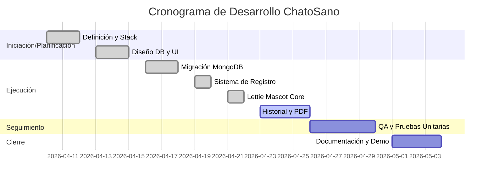

# Plan de Trabajo Estructurado - Proyecto ChatoSano (CBT 75)

Este documento detalla la estructura y planificación del proyecto siguiendo la metodología de tablero de Trello con vista de Gantt para la gestión integral del desarrollo.

---

## 📋 Estructura del Tablero de Trello

### Fase 1: Iniciación (Completada)
*Fase de definición de objetivos y alcance del proyecto escolar.*
- **Tarea: Definición de requerimientos base**
  - **Descripción:** Identificación de las necesidades del CBT 75 en nutrición.
  - **Criterios de Aceptación:** Documento de alcance aprobado.
  - **Etiquetas:** `Prioridad: Alta`, `Categoría: Gestión`
- **Tarea: Selección de Stack Tecnológico**
  - **Descripción:** Elección de MERN (MongoDB, Express, React, Node).
  - **Criterios de Aceptación:** Entorno de desarrollo configurado.

### Fase 2: Planificación (Completada)
*Diseño de la arquitectura y experiencia de usuario.*
- **Tarea: Diseño de Base de Datos (Relacional Lógico)**
  - **Descripción:** Creación del modelo de datos para estudiantes, comidas y consumos.
  - **Criterios de Aceptación:** Diagrama ER validado.
- **Tarea: Diseño de UI/UX (Lettie & Dashboard)**
  - **Descripción:** Definición de la identidad visual y la mascota interactiva.

### Fase 3: Ejecución (En Progreso)
*Desarrollo técnico de los módulos core.*
- **Tarea: Migración a MongoDB & Mongoose**
  - **Responsable:** Equipo Backend
  - **Duración:** 3 días
  - **Dependencia:** Ninguna
- **Tarea: Implementación de Lettie (Mascota IA)**
  - **Descripción:** Desarrollo de la lógica de humor y chat basada en OMS.
  - **Checklist:**
    - [x] Lógica de expresiones
    - [x] Integración de chat
    - [x] Animación de movimiento
- **Tarea: Módulo de Historial y Reportes**
  - **Criterios de Aceptación:** Exportación a PDF funcional.

### Fase 4: Seguimiento y Control (Pendiente)
*Aseguramiento de calidad y métricas de progreso.*
- **Tarea: Pruebas Unitarias OMSAdvisor**
  - **Descripción:** Validar que Lettie dé consejos correctos.
  - **Prioridad:** Media
- **Tarea: Revisión Semanal de Avance (Sprint Review)**
  - **Frecuencia:** Cada viernes.

### Fase 5: Cierre (Pendiente)
*Finalización y entrega del proyecto.*
- **Tarea: Documentación Técnica Final**
- **Tarea: Presentación Escolar (Demo)**

---

## 📅 Cronograma General (Vista de Gantt)

---

## 📈 Métricas de Progreso y Puntos de Control

1. **Burn-down Chart:** Seguimiento de tarjetas Trello completadas vs. pendientes.
2. **Cobertura de Pruebas:** Mínimo 80% en lógica de negocio (OMSAdvisor).
3. **Punto de Control (Milestone):** Presentación de MVP funcional el 25 de Abril.

---

## 📢 Recomendaciones No Técnicas

### 1. Comunicación del Equipo
- **Daily Sync:** Reuniones de 10 minutos para identificar bloqueos (cuellos de botella).
- **Canal de Comunicación:** Uso de Slack o Discord para hilos técnicos específicos.

### 2. Gestión de Stakeholders (Docentes/Directivos)
- **Reporte Quincenal:** Enviar un resumen ejecutivo del progreso y próximos pasos.
- **Validación de Usuarios:** Realizar pruebas de usabilidad con 3-5 estudiantes reales.

### 3. Mejora Continua
- **Retrospectiva:** Al finalizar cada fase, analizar qué salió bien y qué se puede mejorar.
- **Capacitación:** Sesión de 1 hora para el personal de cafetería sobre el uso del panel.

---

## 🛠️ Recursos Necesarios
- **Software:** MongoDB Compass, VS Code, Trello (Power-Up de Gantt).
- **Documentación:** Manuales de la OMS, Documentación de Mongoose.
